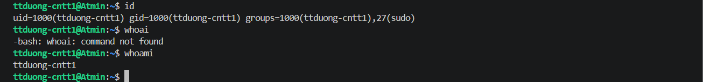
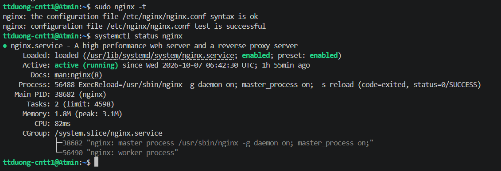
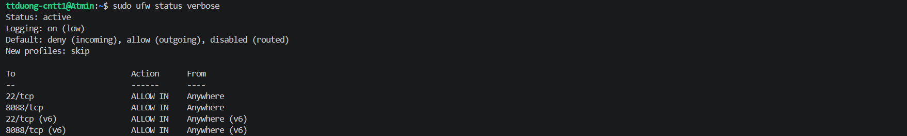
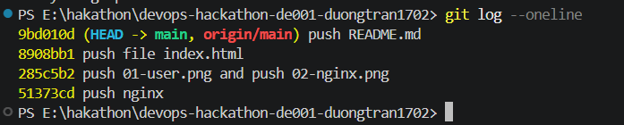

# DevOps Hackathon - Đề 001: Quản lý phòng Lab

## 1. Thông tin sinh viên
| Họ và tên | Mã sinh viên | Lớp | Tài khoản Linux | GitHub | Cổng Nginx |
| :--- | :--- | :--- | :--- | :--- | :--- |
| **Trần Trí Dương** | **B24DTCN098** | **CNTT1** | `ttduong-cntt1` | [duongtran1702](https://github.com/duongtran1702) | `8088` |

## 2. Môi trường triển khai
- Hệ điều hành: Ubuntu 24.04.2 LTS
- VPS IP: 221.121.4.77
- Nginx: 1.24.0
- Git: 2.43.0
- Tường lửa UFW: active

## 3. Cấu trúc dự án
devops-hackathon-de001-duongtran1702/
├── src/
│   └── index.html
├── nginx/
│   └── ttduong-cntt1.conf
├── screenshots/
│   ├── 01-user.png
│   ├── 02-nginx.png
│   ├── 03-ufw.png
│   ├── 04-website.png
│   ├── 05-git-log.png
│   └── 06-update.png
├── .gitignore
└── README.md

## 4. Cấu hình Nginx
| Tham số | Giá trị | Giải thích |
| :--- | :--- | :--- |
| <PORT> | 8088 | Cổng riêng được phân bổ cho sinh viên |
| <SERVER_NAME> | 221.121.4.77 | Địa chỉ IP máy chủ |
| <WEB_ROOT> | /var/www/devops-hackathon-de001-duongtran1702/src | Thư mục web root chứa mã nguồn index.html |
| <INDEX_FILE> | index.html | Trang mặc định tải khi truy cập |
| <TEN_TAI_KHOAN> | ttduong-cntt1 | Tên người dùng đặt file log |
| <ALLOW_DIRECTIVE> | allow all; | Cho phép mọi request bên ngoài |

## 5. Tường lửa UFW
- 22/tcp: ALLOW IN Anywhere (SSH)
- 8088/tcp: ALLOW IN Anywhere (Website)

## 6. Các bước triển khai
1. Tạo user `ttduong-cntt1`, cấp quyền sudo.
2. Cài đặt nginx, git, ufw, curl.
3. Clone repository về `/var/www/devops-hackathon-de001-duongtran1702`.
4. Kích hoạt Server Block Nginx và symlink sang sites-enabled.
5. Mở cổng UFW và reload Nginx.

## 7. Kiểm tra & minh chứng
- 
- 
- 
- 
- 
- 

## 8. Quy trình cập nhật website
1. Sửa `src/index.html` thêm dòng Cập nhật lần 2 -> commit -> push.
2. Trên VPS: git pull tại `/var/www/devops-hackathon-de001-duongtran1702` (không cần reload Nginx).
3. Mở trình duyệt F5 kiểm tra kết quả.

## 9. Sự cố gặp phải & cách khắc phục
- Đã gỡ bỏ site default `/etc/nginx/sites-enabled/default` để giải phóng cổng.
- Đã phân quyền `chown -R ttduong-cntt1:ttduong-cntt1` để kéo code từ xa không cần sudo.
